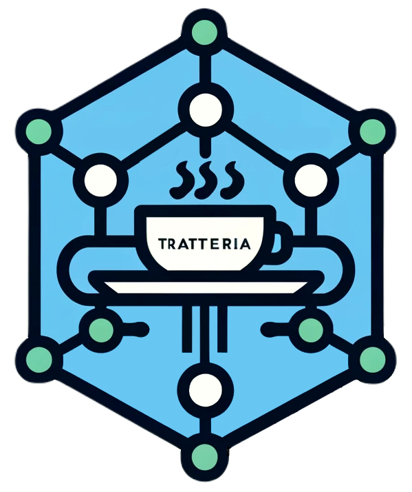

  

Tratteria is an open source Transaction Tokens (TraTs) Service. The Transaction Tokens draft is defined [here](https://datatracker.ietf.org/doc/draft-ietf-oauth-transaction-tokens/). This repository contains the source code and deployment resources for the Tratteria service.

## Deployment Resources and Instructions
For deployment resources and instructions of the tratteria service, please refer to the `kubernetes` subdirectory.

## Tratteria Documentation
For detailed documentation and setup guides of tratteria please visit tratteria official documentation page: [tratteria.io](https://tratteria.io)

## Contribute to Tratteria
Contributions to the project are welcome, including feature enhancements, bug fixes, and documentation improvements.